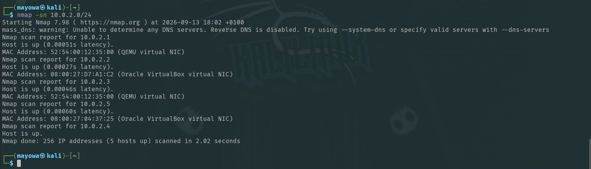
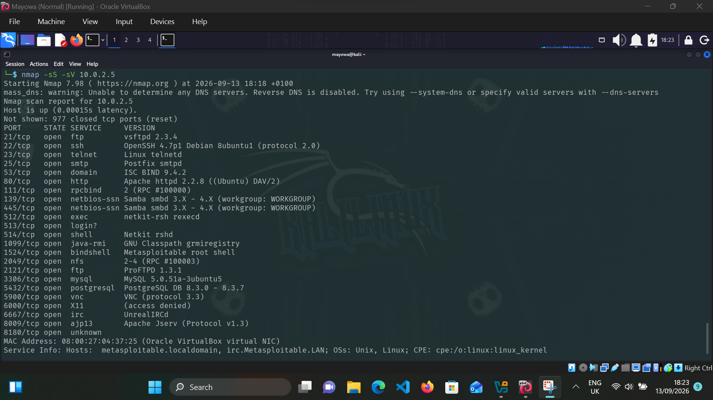
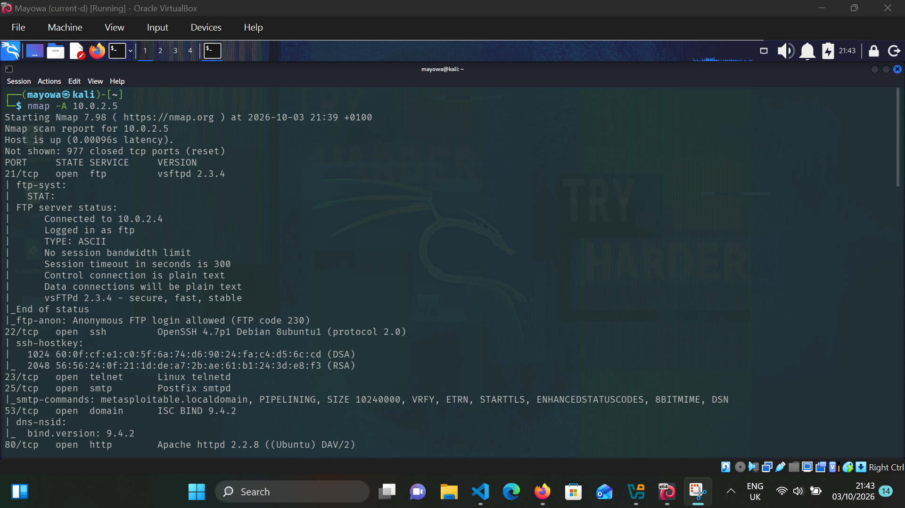
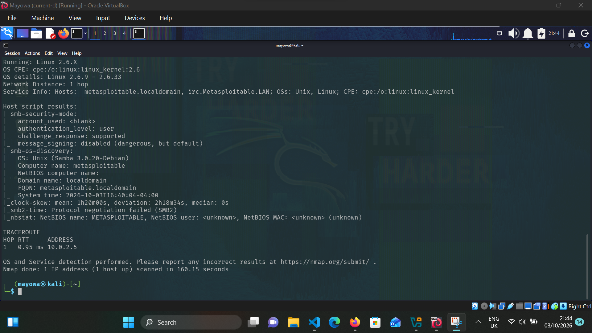
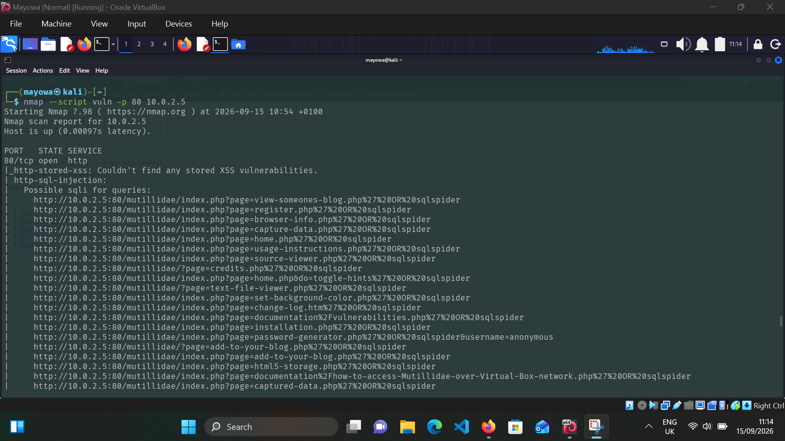
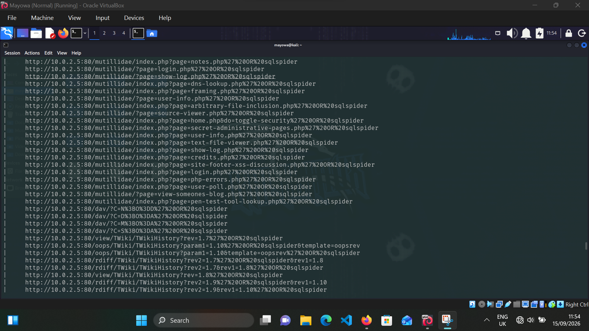

# Nmap Network Reconnaissance & Service Enumeration

## Project Overview

A network reconnaissance and service enumeration assessment of **Metasploitable 2** in a controlled, authorized laboratory environment.

The assessment focused on identifying the target's exposed attack surface, including live hosts, open TCP ports, running services, service versions, operating system information, and potential security issues identified through Nmap NSE scripts.

## Objectives

* Discover the target host on the lab network
* Identify open TCP ports and exposed services
* Determine service versions
* Identify the target operating system
* Perform additional security enumeration using Nmap NSE
* Document findings and possible areas for further assessment

## Lab Environment

| Role     | System                      |
| -------- | --------------------------- |
| Attacker | Kali Linux `10.0.2.4`       |
| Target   | Metasploitable 2 `10.0.2.5` |
| Network  | NAT Network                 |
| Tool     | Nmap                        |

---

## 1. Host Discovery

The first step was to identify active hosts on the local lab network.

```bash
nmap -sn 10.0.2.0/24
```

The `-sn` option performs host discovery without conducting a port scan.

The scan identified the Metasploitable 2 machine at:

```text
10.0.2.5
```



---

## 2. TCP SYN Scan & Service Version Detection

After identifying the target, I performed a TCP SYN scan combined with service version detection.

```bash
sudo nmap -sS -sV 10.0.2.5
```

* `-sS` performs a TCP SYN scan to identify open ports.
* `-sV` attempts to determine the service and version running on each discovered port.

### Results



These results provide an initial view of the services exposed by the target and help identify services that may require deeper investigation.

---

## 3. OS & Additional Enumeration

I then used Nmap's aggressive scan to gather additional information about the target.

```bash
sudo nmap -A 10.0.2.5
```

The `-A` option enables several advanced detection features, including:

* OS detection
* Service/version detection
* Default NSE scripts
* Traceroute

### OS Detection

```text
Linux 2.6.9 - 2.6.33
```

OS detection is based on network fingerprinting, so the result should be treated as an informed estimate rather than definitive confirmation.





---

## 4. NSE Security Enumeration

After identifying the services exposed by the target, I used Nmap's vulnerability-related NSE scripts to perform additional security checks.

```bash
sudo nmap --script vuln 10.0.2.5
```

The `--script vuln` option runs NSE scripts designed to identify potential vulnerabilities across the target's discovered services.

### Results

Nmap's NSE scan reported **possible SQL injection points** within the Mutillidae web application through the `http-sql-injection` script.

The scan also reported that no stored XSS vulnerabilities were identified by the `http-stored-xss` script.

NSE results are **indicators rather than automatic confirmation of vulnerabilities**. Any reported issue should be manually validated before being considered a confirmed security finding.





---

## Key Findings

The reconnaissance phase revealed multiple exposed services on the Metasploitable 2 host, including FTP, SSH, HTTP, SMB, database, VNC, and Tomcat services.

1. **vsftpd 2.3.4 on port 21** — an outdated FTP service identified during service enumeration and a candidate for further security investigation.

2. **Apache httpd 2.2.8 on port 80** — an older web server hosting the Mutillidae application, providing a web attack surface for further assessment.

3. **Possible SQL injection indicators on the Mutillidae application** — Nmap's `http-sql-injection` NSE script reported possible SQL injection points. These results require manual validation before being treated as a confirmed vulnerability.

The main takeaway from the assessment was that **service exposure alone does not mean a vulnerability exists**. Enumeration provides the information needed to identify services and applications that require deeper security testing.

## Recommendations

* Disable services that are not required.
* Restrict exposed services using firewall rules or network segmentation.
* Upgrade outdated software and services.
* Replace insecure legacy protocols with more secure alternatives where possible.
* Investigate services with known vulnerabilities.
* Manually validate automated NSE findings before reporting them as confirmed vulnerabilities.
* Perform a follow-up vulnerability assessment after remediation.

---

## What I Learned

This assessment helped me understand that reconnaissance is more than simply finding open ports.

An open port tells you that a service is reachable. **Service enumeration adds context by identifying what is actually running, which version is exposed, and where further security testing should be focused.**

I also learned that automated scanner output should not automatically be treated as a confirmed vulnerability. Findings need to be reviewed and validated before drawing conclusions.

## Future Improvements

* Compare Nmap results with Nessus or OpenVAS findings.
* Perform deeper enumeration of selected services.
* Research identified service versions for known CVEs.
* Manually validate potential vulnerabilities.
* Document confirmed vulnerabilities and their security impact.
* Re-scan the system after remediation and compare the results.

---

## Repository Structure
nmap-network-recon/
├── README.md
└── screenshots/
    ├── 01-host-discovery.png
    ├── 02-service-enumeration.png
    ├── 03-aggressive-scan-1.png
    ├── 03-aggressive-scan-2.png
    ├── 04-nse-scan-1.png
    └── 04-nse-scan-2.png
```

## Disclaimer

This assessment was conducted against **Metasploitable 2 in a controlled, authorized laboratory environment** for educational and security testing purposes.

Do not scan systems or networks without explicit authorization.

## Author

**Joshua Mayowa**

Cybersecurity Enthusiast | Application Security Learner | Frontend Developer

[](https://www.linkedin.com/in/joshua-mayowa-773bb7375)

[](https://x.com/sudomayor)
